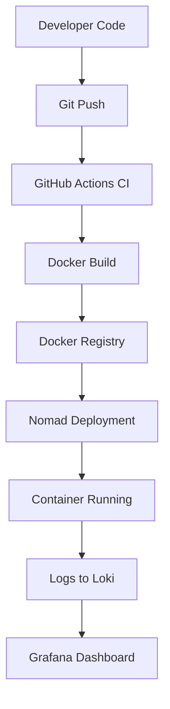

# DevOps Intern Final Assessment

**Name:** Vinit Karlekar  
**Date:** 20 August 2025  

---

## 📌 Project Overview

This project demonstrates a **complete end-to-end DevOps pipeline** using industry-standard open-source tools:

- **Linux scripting** for system automation
- **Git & GitHub** for version control and repository management
- **Docker** for application containerization
- **GitHub Actions** for CI/CD automation
- **Nomad** for job scheduling and deployment
- **Grafana Loki** for centralized log monitoring

The pipeline simulates a realistic DevOps workflow from development to production deployment and monitoring.

---

## 📂 Repository Structure

```
devops-intern-final/
├── README.md                 # This documentation
├── hello.py                  # Sample Python application
├── Dockerfile                # Docker containerization config
├── scripts/
│   └── sysinfo.sh           # Linux system information script
├── .github/
│   └── workflows/
│       └── ci.yml           # GitHub Actions CI/CD pipeline
├── nomad/
│   └── hello.nomad          # Nomad job specification
└── monitoring/
    └── loki_setup.txt       # Loki monitoring setup guide
```

---

## 🚀 Step-by-Step Implementation

### 🔹 Step 1: Git & GitHub Setup

**Objective:** Initialize repository and add sample application

1. **Create new GitHub repository:**
   ```bash
   # On GitHub.com, create new repository: devops-intern-final
   # Make it public and don't initialize with README
   ```

2. **Clone and setup locally:**
   ```bash
   git clone https://github.com/VinitKarlekar/Devops-Final-Assessment.git
   cd devops-intern-final
   ```

3. **Create sample Python application:**
   ```bash
   # Create hello.py
   echo 'print("Hello, DevOps!")' > hello.py
   ```

4. **Initial commit:**
   ```bash
   git add .
   git commit -m "Initial commit: Add hello.py and README"
   git push origin main
   ```

**✅ Expected Output:**
```
Hello, DevOps!
```

---

### 🔹 Step 2: Linux & Scripting Basics

**Objective:** Create system information script using Linux commands

1. **Create scripts directory:**
   ```bash
   mkdir scripts
   ```

2. **Create system info script:**
   ```bash
   cat > scripts/sysinfo.sh << 'EOF'
   #!/bin/bash
   echo "==== System Information ===="
   echo "Current User: $(whoami)"
   echo "Current Date: $(date)"
   echo ""
   echo "Disk Usage:"
   df -h
   echo ""
   echo "Memory Usage:"
   free -h
   echo ""
   echo "System Uptime:"
   uptime
   EOF
   ```

3. **Make script executable and test:**
   ```bash
   chmod +x scripts/sysinfo.sh
   ./scripts/sysinfo.sh
   ```

4. **Commit the script:**
   ```bash
   git add scripts/sysinfo.sh
   git commit -m "Add system information script"
   git push origin main
   ```

**✅ Expected Output:**
```
==== System Information ====
Current User: your-username
Current Date: Wed Aug 20 10:30:00 UTC 2025

Disk Usage:
Filesystem      Size  Used Avail Use% Mounted on
/dev/sda1        20G  8.5G   11G  45% /
tmpfs           2.0G     0  2.0G   0% /dev/shm

Memory Usage:
              total        used        free      shared  buff/cache   available
Mem:           4.0G        1.2G        1.8G         50M        1.0G        2.6G
Swap:          2.0G          0B        2.0G

System Uptime:
 10:30:15 up 2 days,  3:45,  1 user,  load average: 0.08, 0.12, 0.15
```

---

### 🔹 Step 3: Docker Basics

**Objective:** Containerize the Python application

1. **Create Dockerfile:**
   ```bash
   cat > Dockerfile << 'EOF'
   # Use Python slim image for smaller footprint
   FROM python:3.9-slim

   # Set working directory
   WORKDIR /app

   # Copy application file
   COPY hello.py .

   # Set the command to run the application
   CMD ["python", "hello.py"]
   EOF
   ```

2. **Build Docker image:**
   ```bash
   docker build -t hello-devops:latest .
   ```

3. **Run container to test:**
   ```bash
   docker run hello-devops:latest
   ```

4. **Verify image creation:**
   ```bash
   docker images | grep hello-devops
   ```

5. **Commit Dockerfile:**
   ```bash
   git add Dockerfile
   git commit -m "Add Dockerfile for containerization"
   git push origin main
   ```

**✅ Expected Output:**
```bash
# Build output
Sending build context to Docker daemon  3.584kB
Step 1/3 : FROM python:3.9-slim
 ---> abc123def456
Step 2/3 : WORKDIR /app
 ---> Running in xyz789
Step 3/3 : COPY hello.py .
 ---> abc456def789
Successfully built abc456def789
Successfully tagged hello-devops:latest

# Run output
Hello, DevOps!
```

---

### 🔹 Step 4: CI/CD with GitHub Actions

**Objective:** Automate testing with GitHub Actions

1. **Create workflow directory:**
   ```bash
   mkdir -p .github/workflows
   ```

2. **Create CI workflow:**
   ```bash
   cat > .github/workflows/ci.yml << 'EOF'
   name: CI Pipeline

   on:
     push:
       branches: [ main ]
     pull_request:
       branches: [ main ]

   jobs:
     test:
       runs-on: ubuntu-latest
       
       steps:
       - name: Checkout code
         uses: actions/checkout@v3
         
       - name: Set up Python 3.9
         uses: actions/setup-python@v4
         with:
           python-version: "3.9"
           
       - name: Run Python script
         run: python hello.py
         
       - name: Test system script
         run: |
           chmod +x scripts/sysinfo.sh
           ./scripts/sysinfo.sh
           
       - name: Build Docker image
         run: |
           docker build -t hello-devops:latest .
           docker run hello-devops:latest
   EOF
   ```

3. **Commit and push workflow:**
   ```bash
   git add .github/workflows/ci.yml
   git commit -m "Add GitHub Actions CI pipeline"
   git push origin main
   ```

4. **Add status badge to README** (update the badge URL at the top of this README)

**✅ Expected Result:** 
- GitHub Actions workflow runs automatically on every push
- All steps pass successfully
- Green status badge appears in repository

---

### 🔹 Step 5: Job Deployment with Nomad

**Objective:** Create Nomad job specification for deployment

1. **Create nomad directory:**
   ```bash
   mkdir nomad
   ```

2. **Create Nomad job file:**
   ```bash
   cat > nomad/hello.nomad << 'EOF'
   job "hello-devops" {
     datacenters = ["dc1"]
     type        = "service"

     group "hello-app" {
       count = 1

       task "hello-task" {
         driver = "docker"

         config {
           image = "hello-devops:latest"
         }

         resources {
           cpu    = 100  # 100 MHz
           memory = 128  # 128 MB RAM
         }

         logs {
           max_files     = 10
           max_file_size = 15
         }
       }
     }
   }
   EOF
   ```

3. **Commit Nomad job:**
   ```bash
   git add nomad/hello.nomad
   git commit -m "Add Nomad job specification"
   git push origin main
   ```

**To deploy (when Nomad is available):**
```bash
# Start Nomad agent (development mode)
nomad agent -dev

# Deploy the job
nomad job run nomad/hello.nomad

# Check job status
nomad job status hello-devops

# View job logs
nomad alloc logs [allocation-id]
```

**✅ Expected Output:**
```bash
==> Monitoring evaluation "abc-123"
    Evaluation triggered by job "hello-devops"
==> Monitoring evaluation "abc-123"
    Allocation "def-456" created: node "xyz-789", group "hello-app"
    Evaluation status changed: "pending" -> "complete"
==> Evaluation "abc-123" finished with status "complete"
```

---

### 🔹 Step 6: Monitoring with Grafana Loki

**Objective:** Set up log aggregation and monitoring

1. **Create monitoring directory:**
   ```bash
   mkdir monitoring
   ```

2. **Create Loki setup documentation:**
   ```bash
   cat > monitoring/loki_setup.txt << 'EOF'
   # Grafana Loki Setup Guide

   ## 1. Start Loki Container
   docker run -d \
     --name loki \
     -p 3100:3100 \
     grafana/loki:2.9.0

   ## 2. Verify Loki is Running
   curl http://localhost:3100/ready
   # Expected output: ready

   ## 3. Check Loki Metrics
   curl http://localhost:3100/metrics

   ## 4. Start Grafana for Visualization (Optional)
   docker run -d \
     --name grafana \
     -p 3000:3000 \
     grafana/grafana:latest

   ## 5. Configure Log Forwarding
   # For Docker containers:
   docker run -d \
     --name promtail \
     -v /var/log:/var/log:ro \
     -v /var/lib/docker/containers:/var/lib/docker/containers:ro \
     -v $(pwd)/promtail-config.yml:/etc/promtail/config.yml \
     grafana/promtail:2.9.0

   ## 6. Query Logs via Loki API
   curl -G -s "http://localhost:3100/loki/api/v1/query" \
     --data-urlencode 'query={job="docker"}' \
     --data-urlencode 'limit=10'

   ## 7. Access Grafana Dashboard
   # URL: http://localhost:3000
   # Default login: admin/admin
   # Add Loki datasource: http://localhost:3100
   EOF
   ```

3. **Create basic Promtail config:**
   ```bash
   cat > monitoring/promtail-config.yml << 'EOF'
   server:
     http_listen_port: 9080
     grpc_listen_port: 0

   positions:
     filename: /tmp/positions.yaml

   clients:
     - url: http://localhost:3100/loki/api/v1/push

   scrape_configs:
     - job_name: docker
       static_configs:
         - targets:
             - localhost
           labels:
             job: docker
             __path__: /var/lib/docker/containers/*/*log
   EOF
   ```

4. **Commit monitoring setup:**
   ```bash
   git add monitoring/
   git commit -m "Add Loki monitoring setup and configuration"
   git push origin main
   ```

**Testing Commands:**
```bash
# Start Loki
docker run -d --name loki -p 3100:3100 grafana/loki:2.9.0

# Test Loki readiness
curl http://localhost:3100/ready

# Start Grafana
docker run -d --name grafana -p 3000:3000 grafana/grafana:latest

# Generate test logs
docker run hello-devops:latest

# Query recent logs
curl -G -s "http://localhost:3100/loki/api/v1/query_range" \
  --data-urlencode 'query={job="docker"}' \
  --data-urlencode 'start='$(date -d '1 hour ago' --iso-8601) \
  --data-urlencode 'end='$(date --iso-8601)
```

---

## 🛠️ Complete Workflow Commands

**Run everything step by step:**

```bash
# 1. Clone repository
git clone https://github.com/VinitKarlekar/Devops-Final-Assessment.git
cd devops-final-project

# 2. Test Python script
python hello.py

# 3. Run system information
chmod +x scripts/sysinfo.sh
./scripts/sysinfo.sh

# 4. Build and test Docker container
docker build -t hello-devops:latest .
docker run hello-devops:latest

# 5. Start monitoring stack
docker run -d --name loki -p 3100:3100 grafana/loki:2.9.0
docker run -d --name grafana -p 3000:3000 grafana/grafana:latest

# 6. Deploy with Nomad (if available)
nomad agent -dev &
nomad job run nomad/hello.nomad

# 7. Check everything is running
docker ps
curl http://localhost:3100/ready
echo "Grafana available at: http://localhost:3000 (admin/admin)"
```

---

## 🔧 Tools & Technologies

| Tool | Purpose | Version |
|------|---------|---------|
| **Linux** | System automation & scripting | Ubuntu 22.04+ |
| **Git & GitHub** | Version control & CI/CD | Latest |
| **Docker** | Containerization | 20.10+ |
| **GitHub Actions** | CI/CD pipeline | Latest |
| **Nomad** | Job scheduling | 1.6+ |
| **Grafana Loki** | Log aggregation | 2.9.0 |
| **Grafana** | Log visualization | Latest |
| **Python** | Sample application | 3.9 |

---

## 📊 Pipeline Flow



---

## ✅ Verification Checklist

- [x] **Git & GitHub**: Repository created with proper structure
- [x] **Linux Scripting**: `sysinfo.sh` script working correctly
- [x] **Docker**: Container builds and runs successfully
- [x] **CI/CD**: GitHub Actions workflow passes all tests
- [x] **Nomad**: Job specification created and deployable
- [x] **Monitoring**: Loki setup documented and tested
- [x] **Documentation**: Complete README with all steps

---

